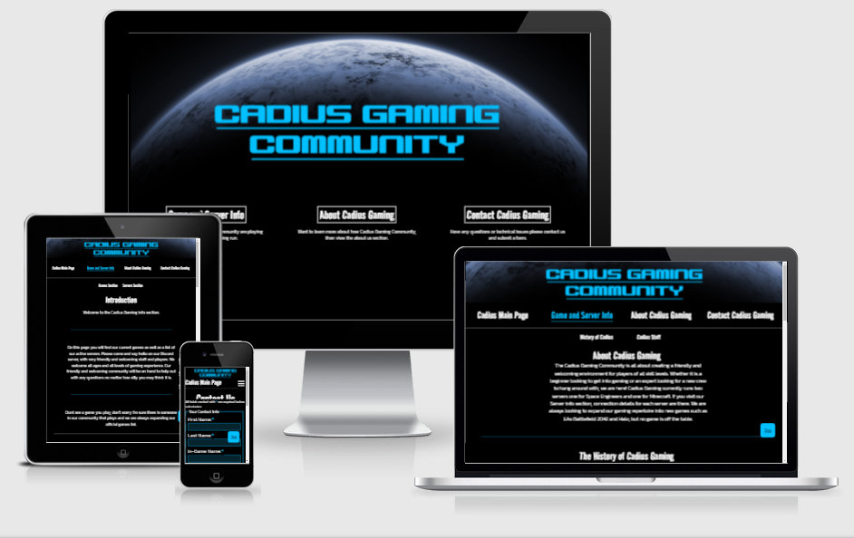
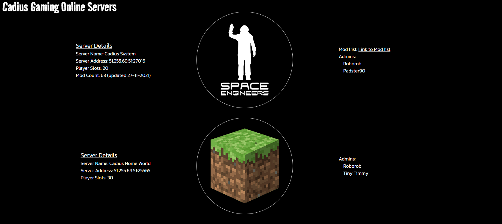

# Cadius Gaming Community

Cadius Gaming is a site that is targeted to anyone that is into gaming or looking to get into gaming, that wants to join a community. The site gives an overview of games played and current staff. It also advertises servers currently being run by the Cadius Gaming Community staff.

Cadius Gaming is a start up community that was created by two individuals who played the game Space Engineers. So with this is mind the site was inspired and styled around space.

To visit the live version of the site (hosted by Github pages) click [here](https://robcole-dev.github.io/Cadius-Gaming/)

## User Stories
 - A section to list active servers with connection details
 - A section to list actively played games
 - A section for users to contact us
 - A section to explain what Cadius Gaming is all about
 - A section to explain the history of Cadius Gaming
 - A staff list so users can see who the staff are

## UX
The UX has a space style theme, which is consistent through the site. It has a custom-made planet in the background with community logo in front. Hover over navigation with changes colour from white to blue.

### Colour Scheme 
The Colour scheme used for this site is a mixture of Black, White, Light Blue and Dark Blue. These colours compliment the planet that sits in the background.

### Typography 
On the site I have used 2 fonts found on Google fonts. I have also used Font Awesome for the social icons in the footer.

Links to the fonts used:

[Kanit](https://fonts.google.com/specimen/Kanit)

[Road Rage](https://fonts.google.com/specimen/Road+Rage)

Links to icons used:

[Facebook Icon](https://fontawesome.com/v5.15/icons/facebook-square?style=brands)

[Instagram Icon](https://fontawesome.com/v5.15/icons/instagram-square?style=brands)

[Twitter Icon](https://fontawesome.com/v5.15/icons/twitter-square?style=brands)

[Youtube Icon](https://fontawesome.com/v5.15/icons/youtube-square?style=brands)

### Wireframes and Designs

Below are a couple of screenshots of Wireframes created for this project and some hand drawn ideas with pencil and paper.

## Features 

Below are a list of key features and future features.

### Existing Features

- __The landing page__

 - The landing page includes an image of a planet with a text overlay. This is to start the theme throughout the site. 
 - This section is kept nice and clean with a small navigation bar to the 3 main pages of the site.

- __The Navigation Bar__

 - The Landing navigation is different from the Main pages. This is due to page design with the idea of the landing page being simple and easy on the eyes.

 - This main page navigation is split into two sections. The first being the navigation to the different pages around the site and the other being a sub menu to navigate on the page to the respective sections. 

 - Both navigation bars have a hover over effect that keeps the contrast consistent throughout the site.

- __Game and Server Section__

 - The game section will allow the user to see the actively played games by the community.
 - The game section will be updated to keep the users up to date with what games Cadius are actively playing.
 

 - The server section will allow the user to see any active servers run by the community staff. The information consists of connection details and a list of current admins.

- __About Cadius section__

 - This section allows the user to learn about how Cadius became what it is today.

- __The Staff Section__

 - This section gives the user a list of current staff.
 - This list will be updated to allow the user to know who the current staff are.

- __The Footer__ 

 - The footer section includes links to the relevant social media sites for Cadius Gaming. The links will open to a new tab to allow easy navigation for the user. 

- __The Contact Us Page__

 - This page will allow the user to get in touch with the staff at Cadius Gaming. This could be for help on how to get into gaming, how to join the Cadius Gaming community or just technical issues.

### Features Left to Implement

- __Forum Section__

 - A new page to be introduced will be the forum section where users can talk to each other and help each other out.

- __Gallary Section__

 - A new page where users can post their own screenshots of games and have other users comment on them.

- __Improved Contact Form__

 - To make sure all forms submitted are correctly and accurately received with any issues being reported on screen to the user.

## Technologies Used

During development of the site a number of programs and web based applications were used. You can find a list of the below:

[Photoshop](https://www.adobe.com/uk/products/photoshop.html) - Used to create the background images

[Balsamiq Wireframes](https://balsamiq.com/) - Used to create the wireframes

[Github](https://github.com/) - Used to host the project

[Gitpod](https://www.gitpod.io/) - Used as a cloud based IDE to code the project

[GIT](https://en.wikipedia.org/wiki/Git) - Used for version control

Code that was used to develop this site are:

[HTML5](https://en.wikipedia.org/wiki/HTML5)\
[CSS3](https://en.wikipedia.org/wiki/CSS)\
[JavaScript](https://en.wikipedia.org/wiki/JavaScript)\

## Testing

For all testing, please refer to the [TESTING.md](TESTING.md) file.

## Deployment

 The site was deployed to GitHub pages. The steps to deploy are as follows: 
 - In the GitHub repository, navigate to the Settings tab 
 - From the source section drop-down menu, select the Main Branch 
 - Once the Main Branch has been selected, the page will be automatically refreshed with a detailed ribbon display to indicate the successful deployment. 

[Link to deployed site](https://robcole-dev.github.io/Cadius-Gaming/)

### Local Deployment

If you would like to make a clone of this repository, you can type the following command in your IDE terminal:

- `git clone https://github.com/robcole-dev/Cadius-Gaming.git`

Alternatively, if using Git pod, you can click below to create your own workspace using this repository.

## Credits 

### Content 

- The icons in the footer were taken from [Font Awesome](https://fontawesome.com/)
- The layout is based on Grid for CSS [Grid Source](https://learncssgrid.com/)

### Media

- The game photos were taken from the relevant games
 - Space Engineers [Space Engineers](https://www.spaceengineersgame.com/media/)
 - Minecraft [Minecraft](https://www.minecraft.net/en-us)
 - War Thunder [War Thunder](https://warthunder.com/en/)
 - WarGame Red Dragon [Wargame Red Dragon](https://www.epicgames.com/store/en-US/p/wargame-red-dragon)

### Acknowledgments

- Tim (My Mentor)
- Aura Cole (My Wife)
- The community over on Code Institute's Slack