## Testing

Below is a list of test that have been carried out with screenshots.

### Browser Compatibility
__Google Chrome__ - Fullscreen\
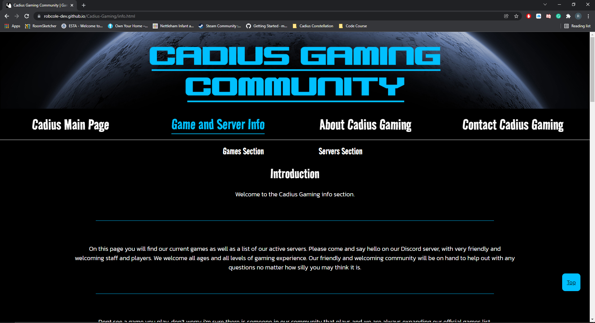

__Microsoft Edge__ - Tablet Screen\
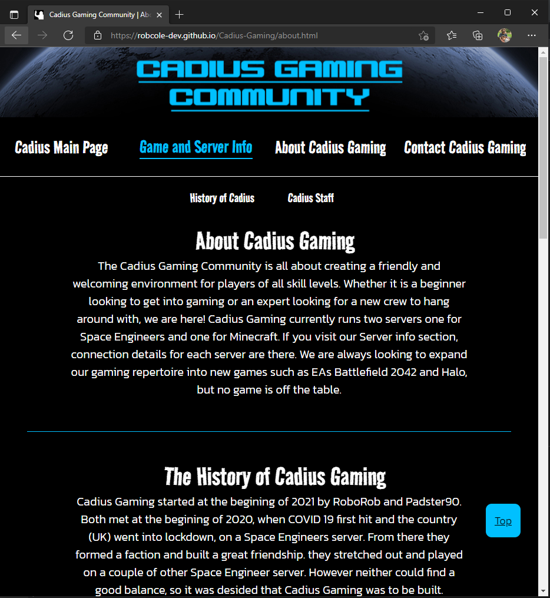

__Firefox__ - Phone Screen\
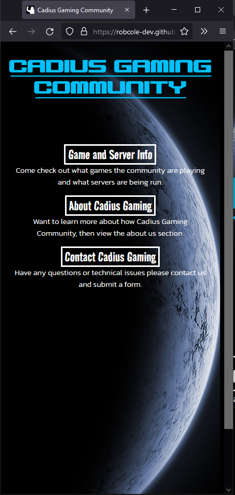

__Samsung Internet App__ - Phone Screen\
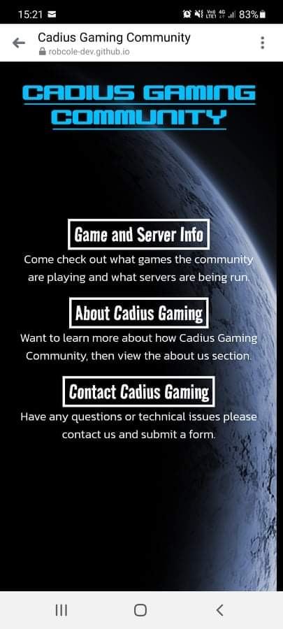

__Apple Safari App__ - Phone Screen\
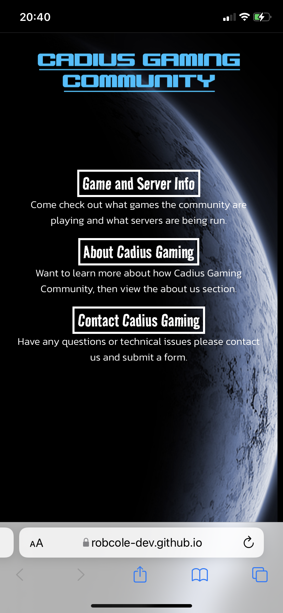

### Code Validation
__HTML__
  - No errors were returned when passing through the official W3C Validator\
  [W3C validator - Index](https://validator.w3.org/nu/?doc=https://robcole-dev.github.io/Cadius-Gaming/index.html)
  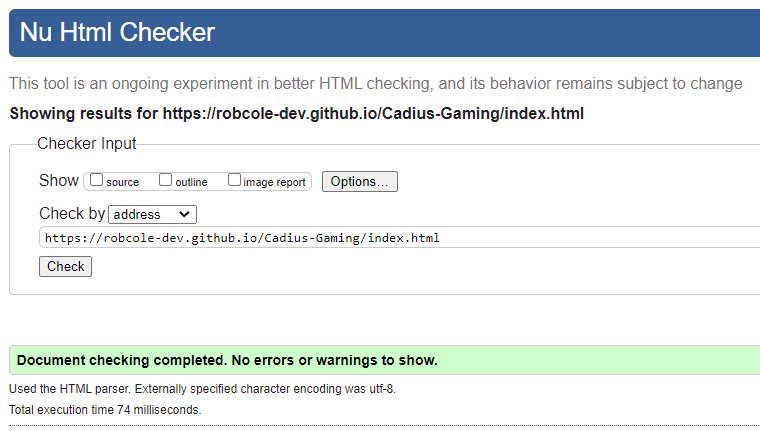
  [W3C validator - Info](https://validator.w3.org/nu/?doc=https://robcole-dev.github.io/Cadius-Gaming/info.html)
  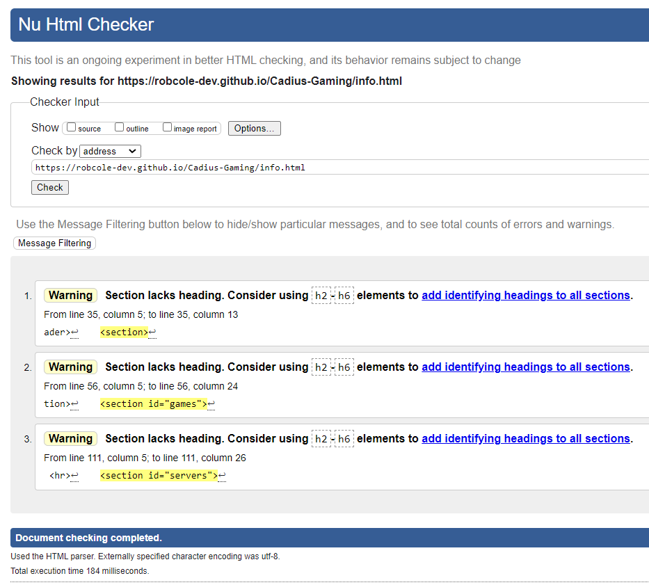
  [W3C validator - About](https://validator.w3.org/nu/?doc=https://robcole-dev.github.io/Cadius-Gaming/about.html)
  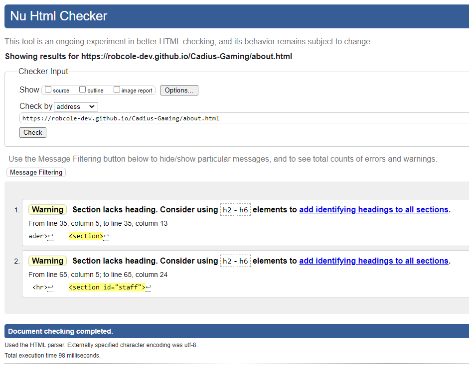
  [W3C validator - Contact](https://validator.w3.org/nu/?doc=https://robcole-dev.github.io/Cadius-Gaming/contact.html)
  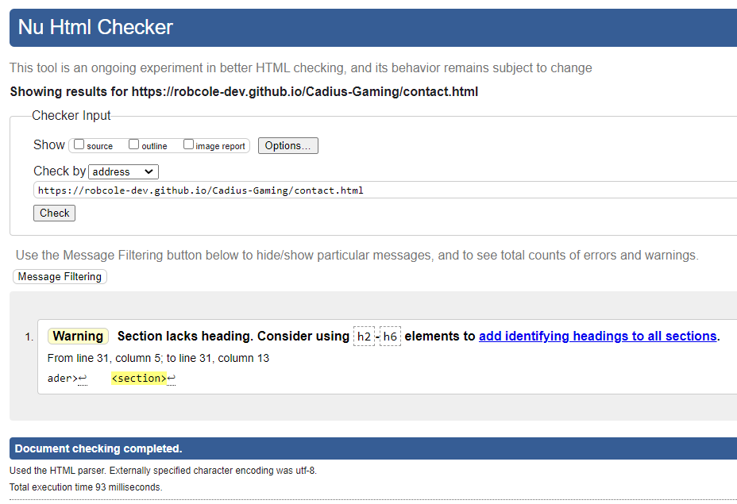

__CSS__
  - No errors were found when passing through the official\
  [(Jigsaw) validator](https://jigsaw.w3.org/css-validator/validator?uri=https%3A%2F%2Frobcole-dev.github.io%2FCadius-Gaming%2F&profile=css3svg&usermedium=all&warning=1&vextwarning=&lang=en)
  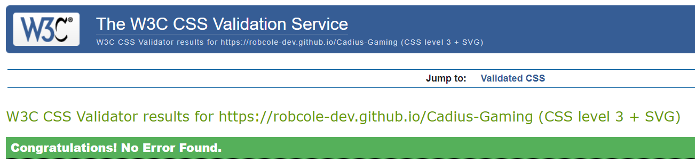

### Responsiveness
__Full Screen - 1920x1080__
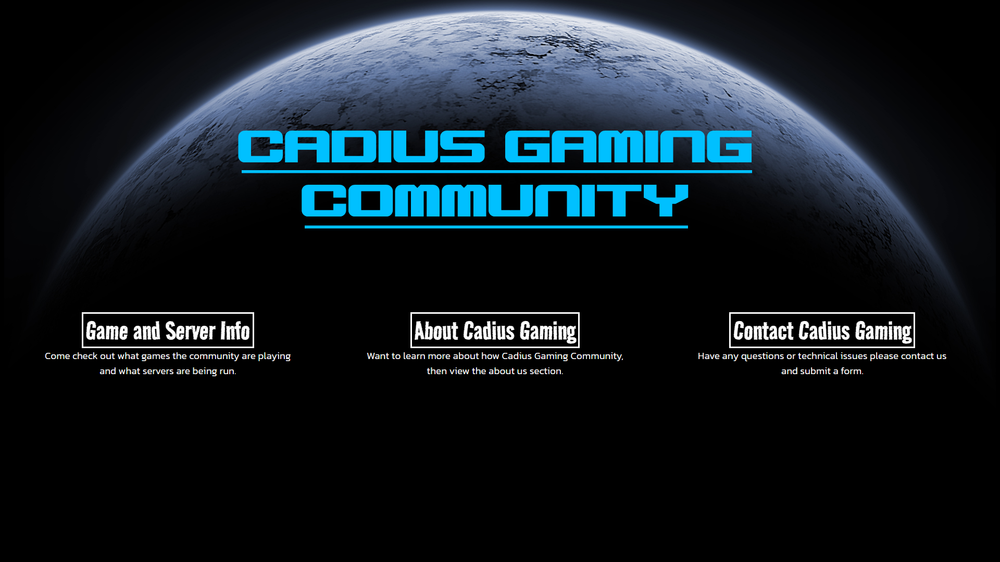

__Tablet Screen__

__Phone Screen - Samsung A71__

### User Story Tests

- Users are able to view the site on mobile devices in landscape and portrait
- Users are able to view the site on tablet devices in landscape and portrait
- Users are able to view the site in the common browsers such as Google Chrome, Firefox and Microsft Edge
- Users are able to see the info, about and contact page on mobile, tablet, Windows or Mac Devices

### Unfixed Bugs

Currently there are no bugs that I am aware of.