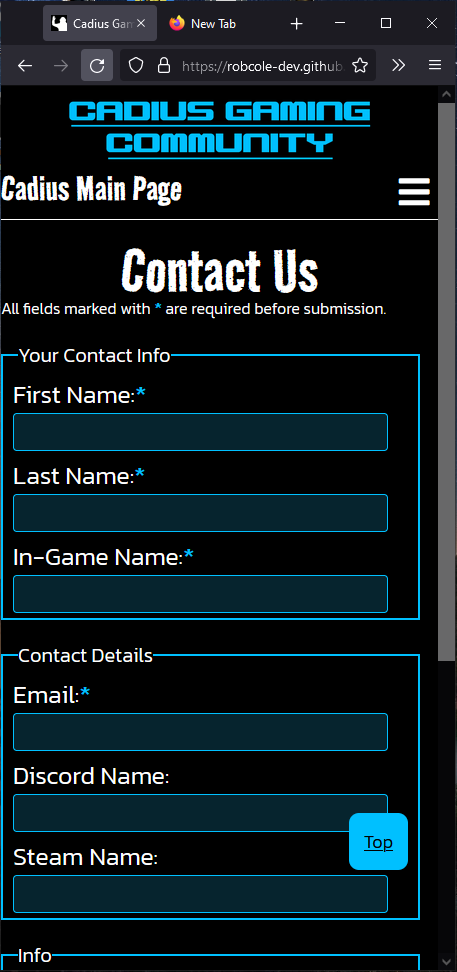
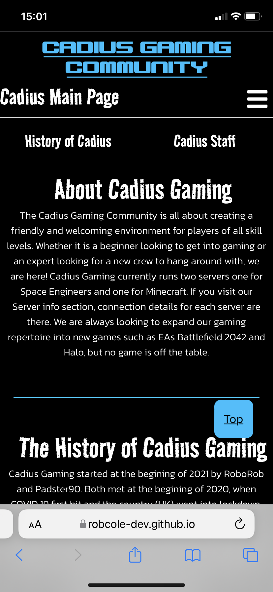

# Testing

Below is a list of test that have been carried out with screenshots.

## Browser Compatibility

The below browsers have been tested with the deployed site.

__Google Chrome__ - Full screen

__Microsoft Edge__ - Tablet Screen

__Firefox__ - Phone Screen

__Samsung Internet App__ - Phone Screen

__Apple Safari App__ - Phone Screen

## Code Validation

__HTML__

No errors were returned when passing through the official W3C Validation

- [W3C validator - Index](https://validator.w3.org/nu/?doc=https://robcole-dev.github.io/Cadius-Gaming/index.html)

 
- [W3C validator - Info](https://validator.w3.org/nu/?doc=https://robcole-dev.github.io/Cadius-Gaming/info.html)

 
- [W3C validator - About](https://validator.w3.org/nu/?doc=https://robcole-dev.github.io/Cadius-Gaming/about.html)

 
- [W3C validator - Contact](https://validator.w3.org/nu/?doc=https://robcole-dev.github.io/Cadius-Gaming/contact.html)

 

__CSS__

No errors were found when passing through the official W3C Validation

- [(Jigsaw) validator](https://jigsaw.w3.org/css-validator/validator?uri=https%3A%2F%2Frobcole-dev.github.io%2FCadius-Gaming%2F&profile=css3svg&usermedium=all&warning=1&vextwarning=&lang=en)
 

## Responsiveness

__Full Screen - 1920x1080__

__Tablet Screen__

__Phone Screen - Apple iPhone 11__

## User Story Tests

 - A section to list active servers with connection details
 
 - A section to list actively played games
 
 - A section for users to contact us
 
 - A section to explain what Cadius Gaming is all about
 
 - A section to explain the history of Cadius Gaming
 
 - A staff list so users can see who the staff are
 

## Unfixed Bugs

Currently there are no bugs that I am aware of.